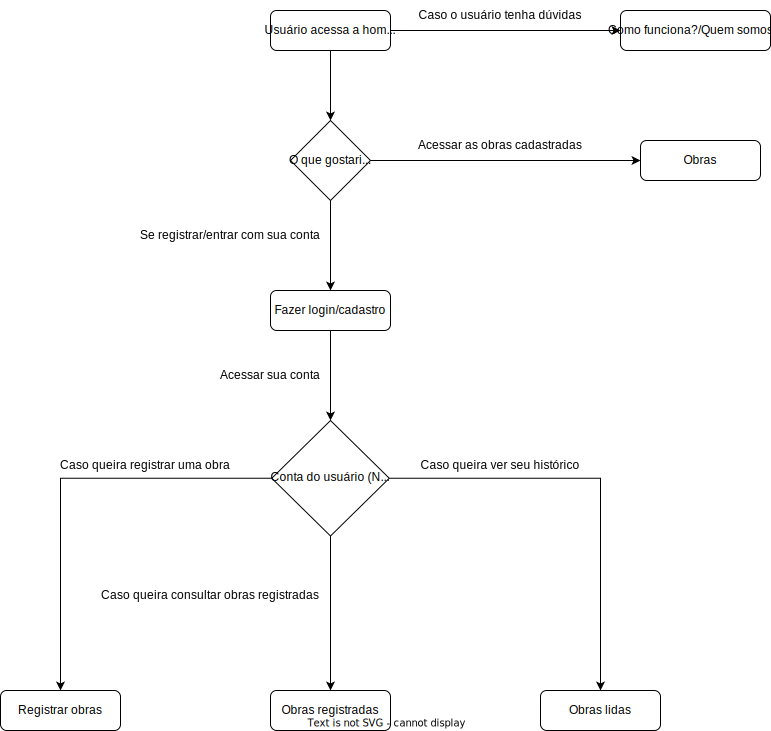
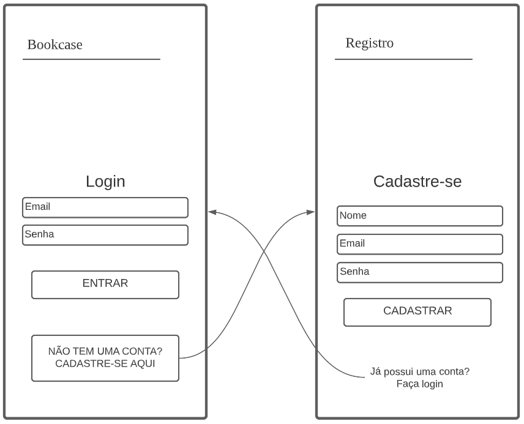
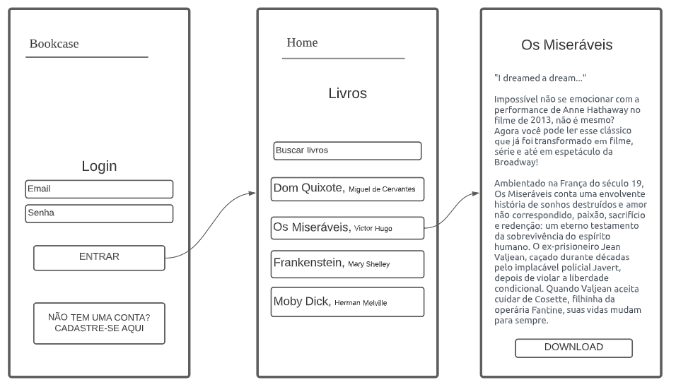
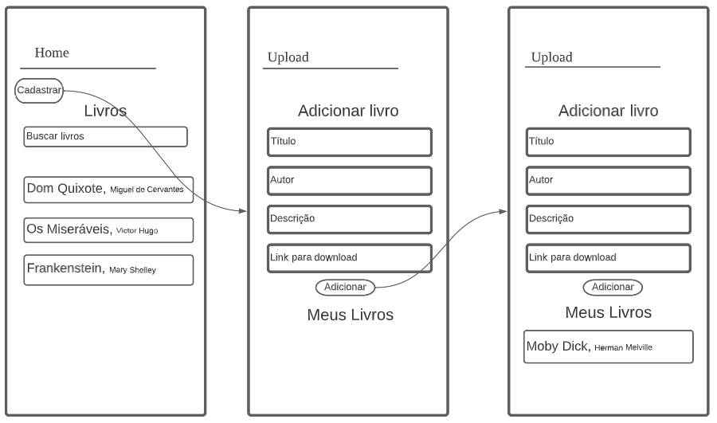
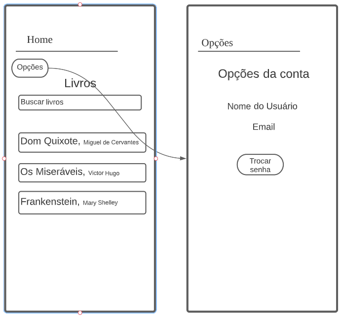

# Projeto de Interface

Pré-requisitos: <a href="2-Especificação do Projeto.md"> Documentação de Especificação</a>

Visão geral da interação do usuário pelas telas do sistema e protótipo interativo das telas com as funcionalidades que fazem parte do sistema (wireframes).

 Apresente as principais interfaces da plataforma. Discuta como ela foi elaborada de forma a atender os requisitos funcionais, não funcionais e histórias de usuário abordados nas <a href="2-Especificação do Projeto.md"> Documentação de Especificação</a>.

## Diagrama de Fluxo

O diagrama apresenta o estudo do fluxo de interação do usuário com o sistema interativo e  muitas vezes sem a necessidade do desenho do design das telas da interface. Isso permite que o design das interações seja bem planejado e gere impacto na qualidade no design do wireframe interativo que será desenvolvido logo em seguida.

O diagrama de fluxo pode ser desenvolvido com “boxes” que possuem internamente a indicação dos principais elementos de interface - tais como menus e acessos - e funcionalidades, tais como editar, pesquisar, filtrar, configurar - e a conexão entre esses boxes a partir do processo de interação. Você pode ver mais explicações e exemplos https://www.lucidchart.com/blog/how-to-make-a-user-flow-diagram.

As referências abaixo irão auxiliá-lo na geração do artefato “Diagramas de Fluxo”.

> **Links Úteis**:
> - [Fluxograma online: seis sites para fazer gráfico sem instalar nada | Produtividade | TechTudo](https://www.techtudo.com.br/listas/2019/03/fluxograma-online-seis-sites-para-fazer-grafico-sem-instalar-nada.ghtml)

## Wireframes

Nesta seção será apresentado como o projeto será utilizado pelo usuário, com o passo a passo de sequência de telas para cada ação específica, por fim, uma visão geral da aplicação.

### Login e Criação de novo usuário

Inicialmente na aplicação, o usuário é apresentado com a opção de entrar com seus dados de login, bem como, se não possuir uma conta, de criar uma conta nova para seu uso, como vemos abaixo:  

### Download de uma obra

Realizando o login com sucesso, o usuário será direcionado para a tela "Home", onde terá acesso ao acervo de obras cadastradas pelos usuários da plataforma, assim como as obras que ele próprio cadastrou. Se interessando por uma obra, ele poderá clicar sobre o card correspondente que o direcionará para a página da obra, que contem um breve resumo e a opção para o download do arquivo.

### Cadastro de uma obra

Se o usuário souber de uma obra que é de domínio público e que ainda não está disponível na plataforma, ele mesmo poderá torná-la disponível para outros usuários. Na tela "Home" há a opção de "cadastrar obra", que direcionará o usuário para o ambiente de cadastro de obras. Nesse ambiente, o usuário deverá, então, fornecer alguns dados sobre a nova obra a ser disponibilizada, tais como: Título, nome do autor, uma breve descrição sobre a obra e o link para download, tal como demonstrado abaixo: 

### Alterar configurações da conta

Caso o usuário deseje, ele também poderá alter as configurações de sua conta, tal como sua senha, por exemplo. Para tanto, na tela "Home", haverá um ícone de engrenagem (já muito utilizado como um sinônimo de "opções" ou "configuração", que remeterá o usuário ao um ambiente em que ele poderá alterar algumas opções referentes à sua conta.

## Protótipo

Um protótipo interativo do Wireframe foi criado para melhor visualização, para vê-lo, <a href="https://marvelapp.com/prototype/ef8c41g/screen/91554961"> clique aqui!</a>

