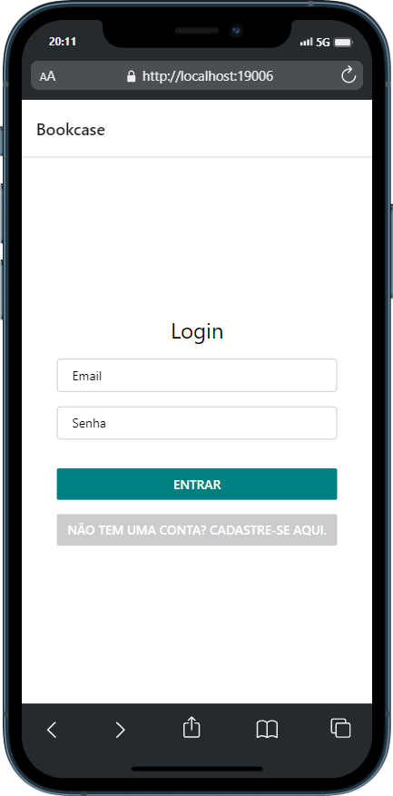
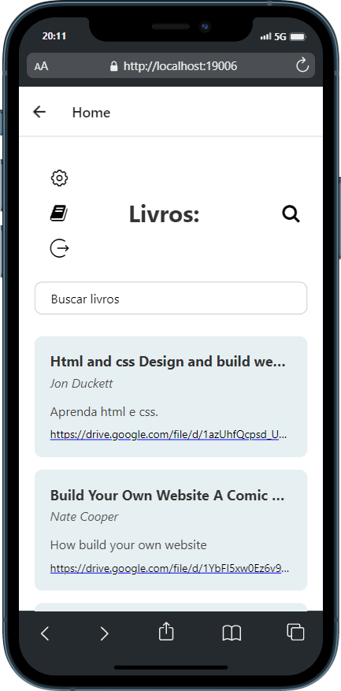

# Template Padrão da Aplicação

A seguir apresentaremos o Template padrão que foi utilizado no desenvolvimento da aplicação, foi feita aopção de um layout minimalista, com cores claras e visualmente agradáveis, que remetem à leitura. O design limpo também torna a experiência do usuário mais tranquila, intuitiva e agradável.

O desenho básico da estrutura, que foi utilizado em todas as telas do aplicativo, é formado por um cabeçalho: que ora contém o título da aplicação ora um bloco com ícones de botões para se acessar funcionalidades do sistema; e também um corpo central, que contem as opções da tela em que se encontra: lista de livros disponíveis, possibilidades de alterações do usuário ou cadastro de novas obras.

Aqui vemos a tela de login da aplicação, que em seu cabeçalho possui ao título do projeto, e em seu corpo principal um bloco com campos para inserção de dados de cadastro e botões para efetivar o login ou encaminhamento para cadastro.

 

 

A tela Home segue o mesmo conceito de cabeçalho e bloco principal. No primeiro temos o nome do ambiente: Home. No segundo um bloco com botões de logout, pesquisa por obras, cadastrar uma obra, opções, e abaixo, o feed de obras já cadastradas por outros usuários.

 

 

