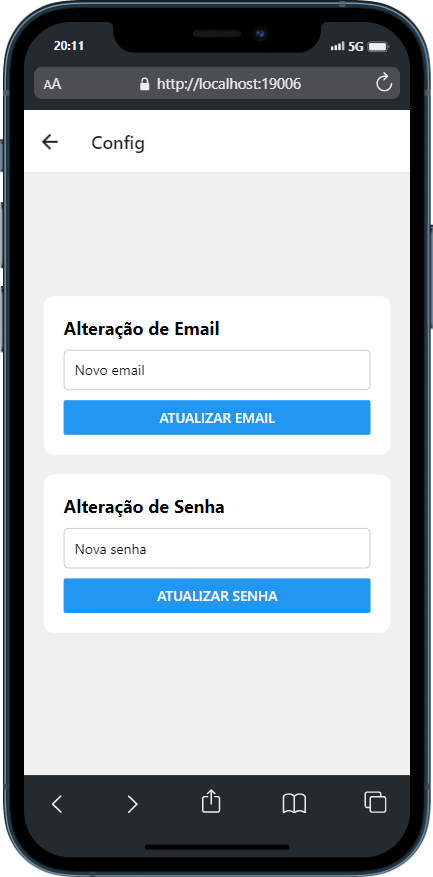
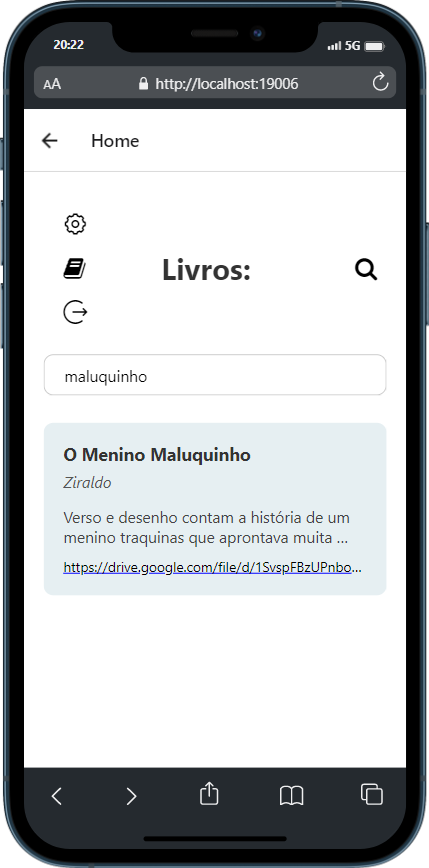
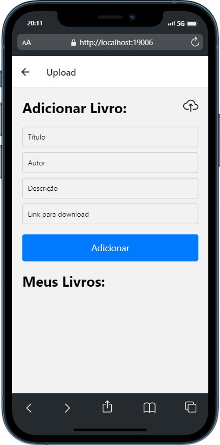
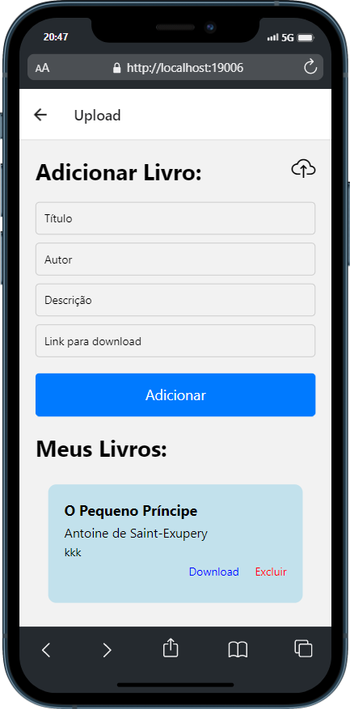
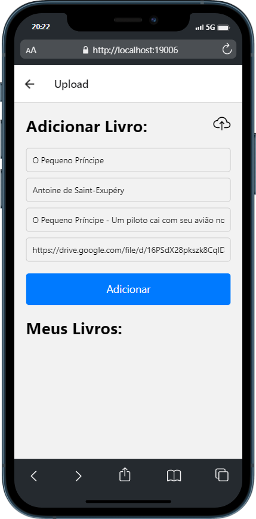

# Programação de Funcionalidades

Nesta seção são apresentadas as telas desenvolvidas para cada uma das funcionalidades do sistema com a atribuição dos requisitos atendidos.

## Tela de Login
 

 
Tela que permite o usuário se cadastrar na plataforma, bem como, após o cadastro, fazer o login com os dados fornecidos no momento em que se cadastrou.
 

### Requisitos atendidos

<li>RF-01 - A aplicação terá tela de Login e Senha;</li>
<li>RNF-01 - A aplicação deverá ser de fácil leitura e entendimento;</li>
<li>RNF-02 - A aplicação deve ser desenvolvida em React Native;</li>
<li>RNF-03 - A aplicação deverá ser responsiva e poderá ser acessada em diversos dispositivos e equipamentos;</li>
<li>RNF-04 - A aplicação deverá ser compatível com diversos navegadores;</li>         
<li>RNF-05 - A aplicação deve permitir o acesso apenas de usuários cadastrados.</li>
 

<u>**Artefatos da funcionalidade**</u>

- App.js
- server.js
- bookRoutes.js
- routes.js
- LoginScreen.js
 

## Tela Home
 

 
Ambiente que permite o usuário visualizar o *feed* de obras disponíveis recomendadas, realizar o download da obra que desejar, bem como acessar opções de conta, realizar logout, cadastrar uma obra para tornála disponível para demais usuários, pesquisar por uma obra que deseje.
 

### Requisitos atendidos

<li>RF-03 - A aplicação deve permitir ao usuário baixar uma obra pesquisada para leitura;</li>
<li>RF-05 - A aplicação deve permitir o usuário acessa um feed de recomendações de livros;</li>
<li>RF-08 - A aplicação permite o logout de usuário;</li>
<li>RNF-01 - A aplicação deverá ser de fácil leitura e entendimento;</li>
<li>RNF-02 - A aplicação deve ser desenvolvida em React Native;</li>
<li>RNF-03 - A aplicação deverá ser responsiva e poderá ser acessada em diversos dispositivos e equipamentos;</li>
<li>RNF-04 - A aplicação deverá ser compatível com diversos navegadores;</li>         
<li>RNF-05 - A aplicação deve permitir o acesso apenas de usuários cadastrados.</li>
 

<u>**Artefatos da funcionalidade**</u>

- HomeScreen.js
- server.js
- bookRoutes.js
- routes.js
 

## Tela de Configurações
 

 
Ambiente que permite o usuário alterar seus dados de cadastro, mudando seu e-mail e senha de acesso.
 

### Requisitos atendidos

<li>RF-05 - A aplicação deve permitir o usuário acessa um feed de recomendações de livros,</li>
<li>RF-06 - A aplicação deve permitir o usuário alterar seus dados de cadastro;</li>
<li>RNF-01 - A aplicação deverá ser de fácil leitura e entendimento;</li>
<li>RNF-02 - A aplicação deve ser desenvolvida em React Native;</li>
<li>RNF-03 - A aplicação deverá ser responsiva e poderá ser acessada em diversos dispositivos e equipamentos;</li>
<li>RNF-04 - A aplicação deverá ser compatível com diversos navegadores;</li>         
<li>RNF-05 - A aplicação deve permitir o acesso apenas de usuários cadastrados.</li>
 

<u>**Artefatos da funcionalidade**</u>

- ConfigScreen.js
- server.js
- bookRoutes.js
- routes.js
 

## Pesquisa por uma obra
 

 
Na tela Home, há uma ferramenta para o usuário buscar por uma obra específica ou utilizar um termo genérico relacionado à obra desejada para procurá-la no feed de obras disponíveis. No caso do exemplo, foi realizado um teste utilizando o termo "maluquinho" para buscar pela obra "O Menino Maluquinho", de Ziraldo. O teste mostra que a ferramenta de busca funciona como esperado.
 

### Requisitos atendidos

<li>RF-02 - A aplicação deve permitir ao usuário buscar uma lista de obras por nome;</li>
<li>RNF-01 - A aplicação deverá ser de fácil leitura e entendimento;</li>
<li>RNF-02 - A aplicação deve ser desenvolvida em React Native;</li>
<li>RNF-03 - A aplicação deverá ser responsiva e poderá ser acessada em diversos dispositivos e equipamentos;</li>
<li>RNF-04 - A aplicação deverá ser compatível com diversos navegadores;</li>         
<li>RNF-05 - A aplicação deve permitir o acesso apenas de usuários cadastrados.</li>
 

<u>**Artefatos da funcionalidade**</u>

- HomeScreen.js
- server.js
- bookRoutes.js
- routes.js
 

## Cadastro de uma obra
 

 
Na tela Home, há um ícone que direciona para o ambiente de cadastro de obras. Nesse ambiente, há campos para a inserção de informações sobre a obra a ser cadastrada: título, autor, descrição da obra (uma breve sinopse) e o link para download. Uma vez preenchidos os campos, há o botão para adicionar a obra.
 

A seguir veremos o ambiente com a obra cadastrada campos preenchidos. Como exemplo foi feito o cadastro do clássico infantil O Pequeno Príncipe, do autor Antoine de Saint-Exupéry. Intencionalmente deixamos a descrição com os caracteres "kkk" como forma de demonstrar a possibilidade de atualizar as informações da obra cadastrada pelo usuário, nesse caso faremos a atualização da descrição, mas seria possível, por exemplo, atualizar o link para download, caso fosse necessário.

 

 

Para atualizar uma obra cadastrada, basta o usuário selecioná-la, dentro do ambiente de cadastro de obras, selecionar o ícone de nuvem no canto superior direito da tela, os dados da obra serão novamente carregados para os campos parametrizados, onde o usuário poderá atualizar as informações.

 

 

### Requisitos atendidos

<li>RF-04 - A aplicação deve permitir a um usuário cadastrar uma obra, e remover uma obra cadastrada por ele;</li>
<li>RF-07 - A aplicação deve permitir o usuário a criar uma descrição sobre a obra cadastrada;</li>
<li>RNF-01 - A aplicação deverá ser de fácil leitura e entendimento;</li>
<li>RNF-02 - A aplicação deve ser desenvolvida em React Native;</li>
<li>RNF-03 - A aplicação deverá ser responsiva e poderá ser acessada em diversos dispositivos e equipamentos;</li>
<li>RNF-04 - A aplicação deverá ser compatível com diversos navegadores;</li>         
<li>RNF-05 - A aplicação deve permitir o acesso apenas de usuários cadastrados.</li>
 

<u>**Artefatos da funcionalidade**</u>

- BookUpScreen.js
- server.js
- bookRoutes.js
- routes.js
 

## Quadro atual das contribuições dos membros do time:

* Carlos Eduardo Favilla Lobo : Especificação do projeto (casos de uso, requisitos e restrições), Projeto de interface e Arquitetuta da Solução (diagramas ER, classes), Programação de Funcionalidades (Criação da navegação do app, telas de cadastro de obra, alteração de cadastro e exclusão de obra)  validação de formulários, implementação do banco de dados. 

* Mariana Júlia Estevam Corrêa : Elaboração da Documentação de Contexto, Metodologia (tecnologias, ferramentas, gerenciamento do projeto),  Programação de funcionalidades (implementação de layouts em telas), Criação do quadro kanban no Trello e gestão de cards com as tarefas, realização do plano de testes e registro de testes (usabilidade e Software). 

* Gabriel Silveira : Especificação do Projeto (Personas, Diagrama Casos de Uso), Programação de funcionalidades (implementação da tela de login), especificação do Templete Padrão da Aplicação.

* Nathália Liberato : Indicadores de Desempenho, Gestaão de Qualidade do Projeto, Qualidade do Software(Tabela com métricas e pontuação).

https://trello.com/b/9iTCPz3Z/untitled-board
